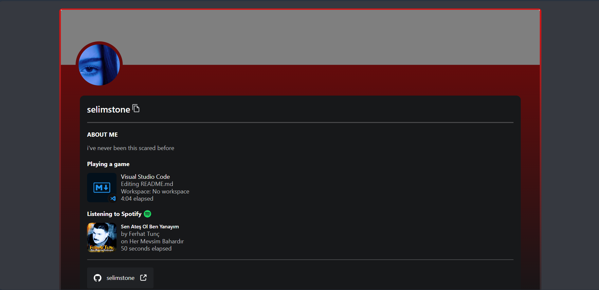

<div align="center">
	<p>
		<a href="https://reactjs.org/"></a>
        <a href="https://www.typescriptlang.org/"></a>
    <a href="https://tailwindcss.com/"></a>
	</p>
</div>

## Getting Started
- Join the [Lanyard Discord server](https://discord.gg/lanyard)
- App.jsx is enough to change the id `<Card id="546303073962950657" />;`

## Start Development Server

```bash
npm start
```

## Build to Production

```bash
npm run build
```

## Attributions

- [Lanyard](https://github.com/Phineas/lanyard) - [Phineas](https://github.com/Phineas)


## License

Distributed under the MIT license. See [``LICENSE``](https://github.com/seliim1337/web/blob/main/LICENSE) for more information.
